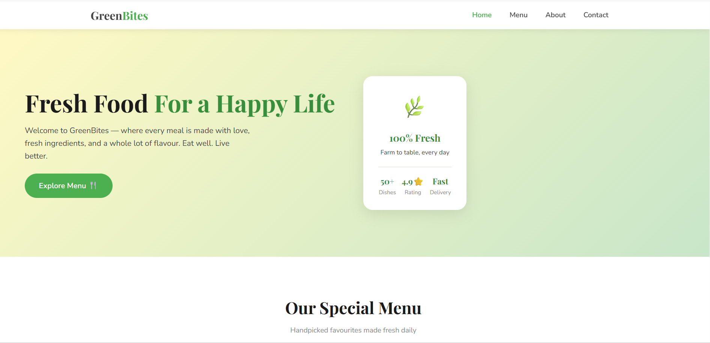
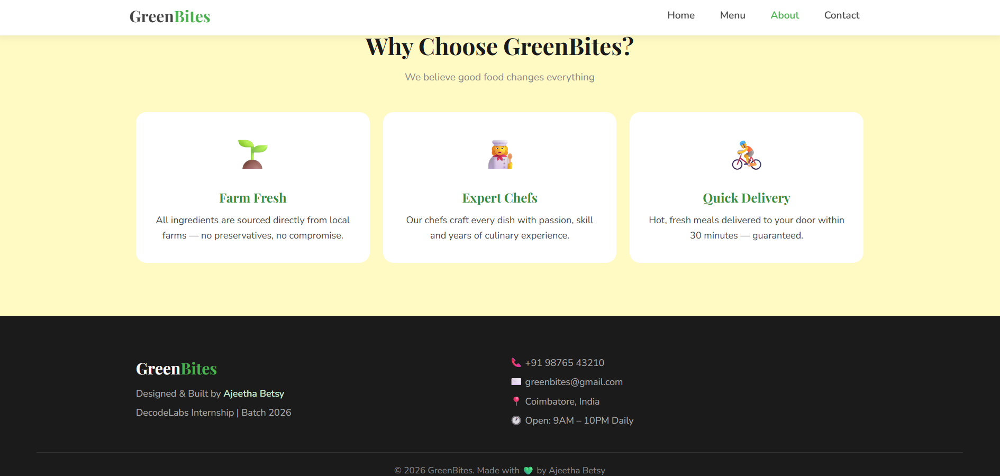
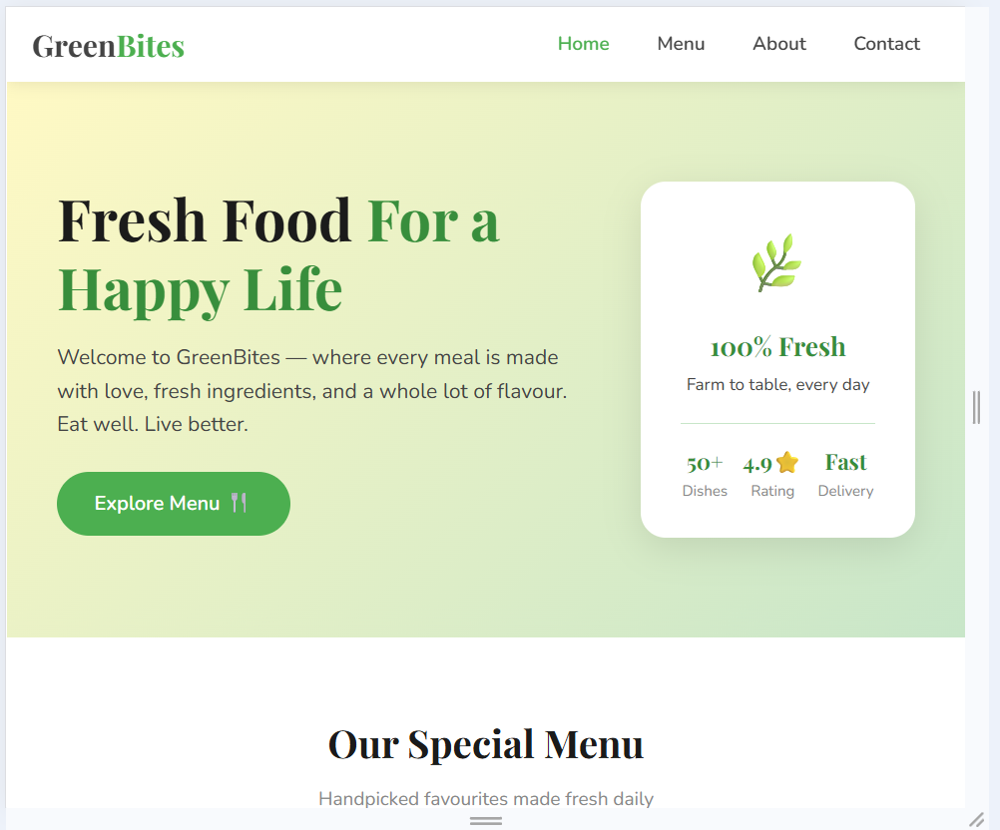
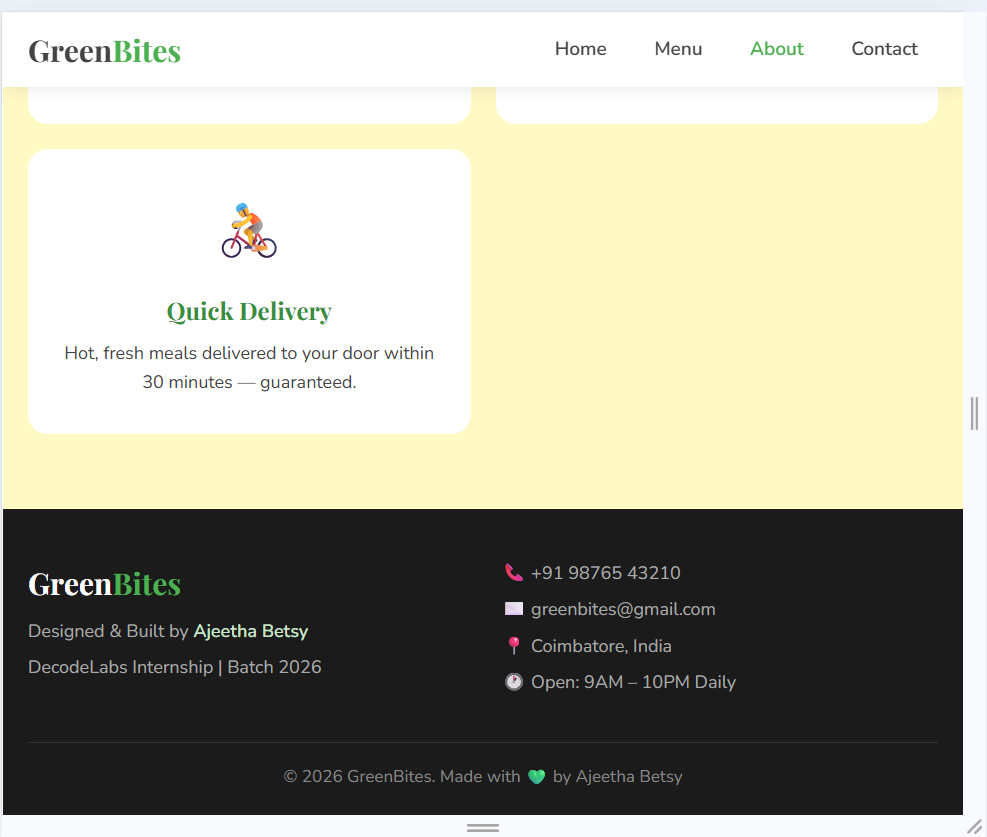
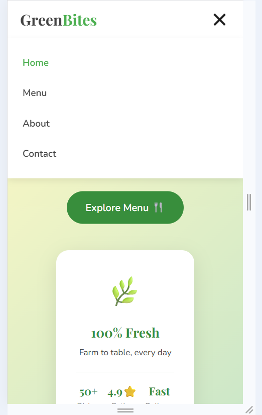
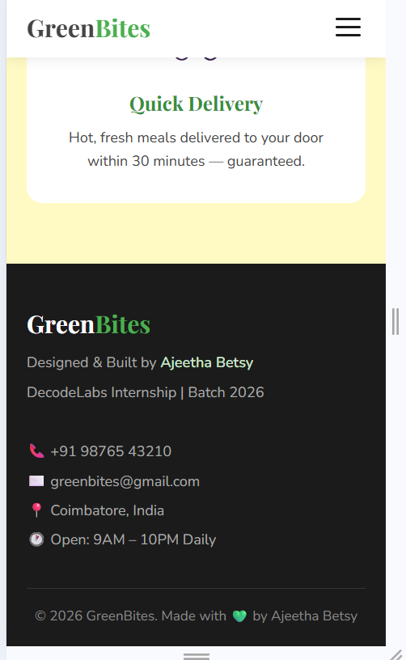

# 🌿 GreenBites — Responsive Restaurant Website

A fully responsive frontend interface for a fictional restaurant, **GreenBites**, built as **Project 1** for the DecodeLabs Full Stack Development Internship (Batch 2026).

---

## 📋 Project Description

GreenBites is a single-page restaurant website that showcases a clean, modern UI with a fresh green color theme. The project demonstrates mobile-first responsive design principles using semantic HTML5, CSS Grid/Flexbox, and vanilla JavaScript — without relying on any frontend frameworks.

The site includes a navigation bar with a mobile hamburger menu, a hero banner, a 6-item food menu grid, an "About" section, and a footer with contact details — all fully responsive across mobile, tablet, and desktop screen sizes.

---

## 🛠️ Tech Stack

| Technology | Purpose |
|------------|---------|
| **HTML5** | Semantic page structure (header, nav, main, article, footer) |
| **CSS3** | Styling, responsive layout (Grid + Flexbox), animations |
| **JavaScript (Vanilla)** | Hamburger menu toggle, scroll-based nav highlighting |
| **Google Fonts** | Playfair Display & Nunito typography |

> No frameworks or libraries used — built with pure HTML, CSS, and JS as required by the project guidelines.

---

## ✨ Features

- ✅ Fully responsive — Mobile (375px), Tablet (768px), Desktop (1024px+)
- ✅ Mobile hamburger menu with open/close animation
- ✅ Sticky navigation bar
- ✅ CSS Grid for menu/about card layouts
- ✅ Flexbox for navbar and component alignment
- ✅ Fluid typography using `clamp()`
- ✅ Hover effects and smooth scroll
- ✅ Clean, semantic, accessible HTML structure
- project1-decodelabs/
│
├── index.html      → Page structure and content
├── style.css       → Styling, responsive breakpoints, color theme
├── script.js       → Hamburger menu interactivity
└── README.md       → Project documentation
---

## 🚀 How to Run Locally

### Prerequisites
- VS Code (or any code editor)
- Live Server Extension for VS Code
- A web browser (Chrome / Edge)

### Steps

1. **Clone or download this repository**
git clone https://github.com/AjeethaBetsy/Task-1-Ajeetha-Betsy-J.git
2. **Open the folder in VS Code**
- File → Open Folder → select `project1-decodelabs`

3. **Install Live Server extension** (if not already installed)
- Go to Extensions (Ctrl+Shift+X) → search "Live Server" → Install

4. **Run the project**
- Right-click `index.html` → "Open with Live Server"
- Website opens automatically at `http://127.0.0.1:5500`

No build steps, no npm install, no dependencies — just open and run! ✅

---

## 📱 Screenshots

### Desktop View
| Top Section | Bottom Section |
|:---:|:---:|
| 

 | 

 |

### Tablet View (768px)
| Top Section | Bottom Section |
|:---:|:---:|
| 

 | 

 |

### Mobile View (375px)
| Menu Open | Footer |
|:---:|:---:|
| 

 | 

> 📌 Screenshot images are stored in the `/screenshots` folder of this repository.

---

## 🎯 Responsive Breakpoints

| Device | Width | Layout |
|--------|-------|--------|
| Mobile | < 768px | Single column, hamburger menu |
| Tablet | ≥ 768px | 2-column grid, full navbar |
| Desktop | ≥ 1024px | 3-column grid, expanded spacing |

---

## 👩‍💻 Author

**Ajeetha Betsy**
DecodeLabs Full Stack Development Internship — Batch 2026
📍 Coimbatore, India

---

## 📄 License

This project was created for educational purposes as part of the DecodeLabs Internship Program.

---
